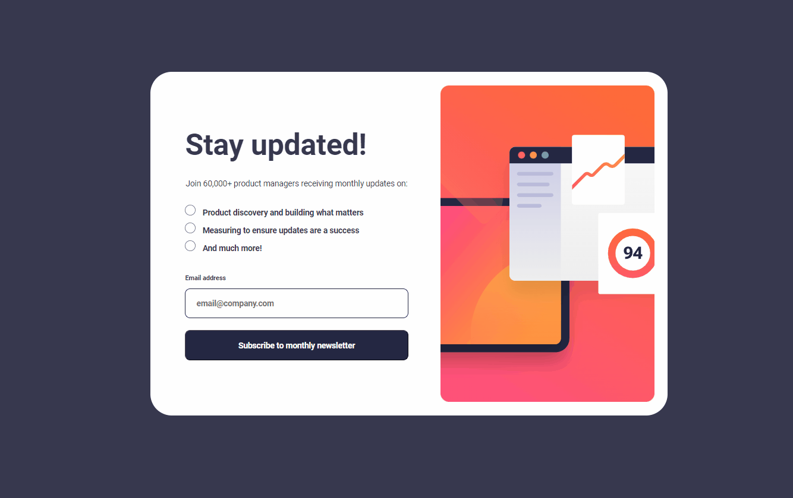

# Projeto Landing Page - Validação de Inscrição com Mensagem de Sucesso

Aplicando conhecimentos adquiridos no curso DevQuest - Dev em dobro.

Este projeto conta com a criação de um layout responsivo para que possa ser aberto em qualquer aparelho, seja em telas grandes ou pequenas e tem como intuito, a aplicação de interações utilizando o JS para verificar se o email inserido é válido e se o campo email foi preenchido corretamente.

Confira meu trabalho abaixo:

## Tecnologias utilizadas:

- HTML
- CSS
- JS
